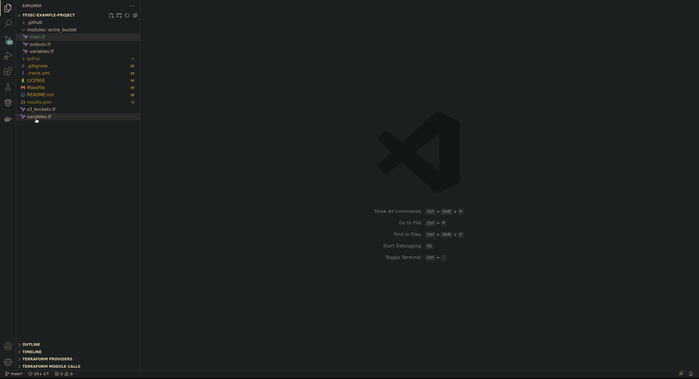
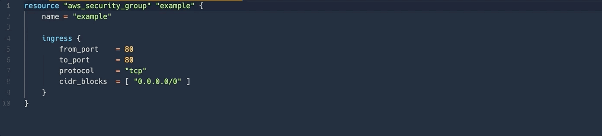

# tfsec

This VS Code extension is for [tfsec](https://tfsec.dev). A static analysis security scanner for your Terraform code that discovers problems with your infrastructure before hackers do.

## Features

### Issue Explorer
The issue explorer displays an an organised view the issues that have been found in the current workspace. 

The code runs tfsec in a VS Code integrated terminal so you can see the the output - when it is complete, press the refresh button to reload.

Right clicking on an tfsec code will let you view the associated page on [https://tfsec.dev](https://tfsec.dev)

Issues can be ignored by right clicking the location in the explorer and selecting `ignore this issue`.

### Ignore Code Resolution

Ignore codes will be automatically resolved and the description of the error will be displayed inline.

## Release Notes

### 1.1.11
- Add menu button to update tfsec from within vscode (post tfsec v0.39.39)
- Add command to show the current version of tfsec running

### 1.1.10
- Updating the codes to support latest tfsec

### 1.1.9
- Handle deprecated checks better in the help window

### 1.1.8
- Add setting to choose if auto running tfsec after ignore should happen

### 1.1.7
- Reload the tree when tfsec is run
- move single line ignores above issue

### 1.1.6
- Add tfsec ignore on a same line when single line issue
- add local check help to the Tfsec navigation pane
- restructure code for easier disable of plugin

### 1.1.5
- Only use a single terminal for tfsec, don't create a new one on each run
- Add option on extension settings to turn off the ignore code resolution
