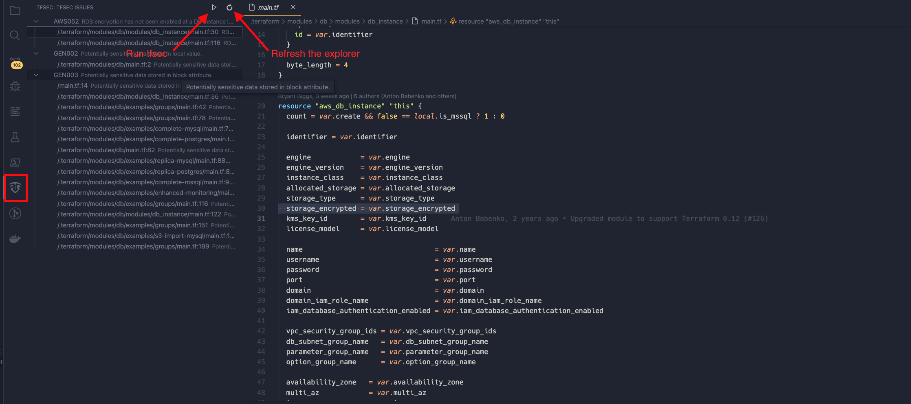

# tfsec

View this extension in the [Marketplace](https://marketplace.visualstudio.com/items?itemName=tfsec.tfsec)

VSCode extension for [tfsec](https://tfsec.dev) with a growing set of features for interacting with tfsec, THE Terraform static analysis tool.

## Features

### Ignore Code Resolution

Ignore codes will be automatically resolved and the description of the error will be displayed inline.

### tfsec Issue Explorer

Initial release of the tfsec Issue Explorer. This control will add a new pane to the tool bar showing the current issues in the workspace. 

Note: In this initial release, it is assumed that `tfsec` is on your path and that you have a relatively new version. The command is run in a terminal so any issues will be displayed and you can raise an issue accordingly. 

## Release Notes

### 1.0.3

Add the treeview for current issues in the workspace

### 1.0.2

Restructuring the code

### 1.0.1

Fixes to the Readme for the marketplace page

### 1.0.0

Initial release of tfsec extension with ignore parsing
