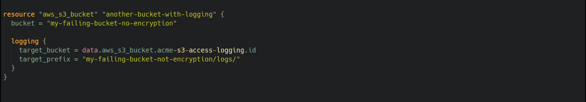

# tfsec

This VS Code extension is for [tfsec](https://aquasecurity.github.io/tfsec/latest). A static analysis security scanner for your Terraform code that discovers problems with your infrastructure before hackers do.

## Features

### Findings Explorer
The Findings Explorer displays an an organised view the issues that have been found in the current workspace. 

The code runs tfsec in a VS Code integrated terminal so you can see the the output - when it is complete, press the refresh button to reload.

Right clicking on an tfsec code will let you view the associated page on [https://aquasecurity.github.io/tfsec/latest](https://aquasecurity.github.io/tfsec/latest)

Issues can be ignored by right clicking the location in the explorer and selecting `ignore this issue`.

### Ignore Code Resolution

Ignore codes will be automatically resolved and the description of the error will be displayed inline.

## Release Notes

### 1.7.0
- Support multi folder workspaces
- Save results in a folder with unique names

### 1.6.2
- Refactor the runner to clean up extension code
- clean up some redundant code

### 1.6.1
- Prettify with nice icons
- 
### 1.6.0
- Switch from ExecSync to Spawn for running tfsec
- Don't show the output window so much, we know its there
- Update mass ignores to always add a new line

### 1.5.0
- Check for tfsec before running any commands
- Add debug setting for richer output option
- remove some redundant logging

### 1.4.1
- Fix updater 

### 1.4.0
- Use output channel instead of terminal for better cross platform command support
- Remove explicit run command and use refresh to update the list with a fresh run
- Add ignore all severity
- Fix the refresh after ignores have been completed
- Add more information to the update output 

### 1.3.1
- Update the repository link

### 1.3.0
- Remove dependency on codes resource for resolving legacy IDs

#### See Change log for more information